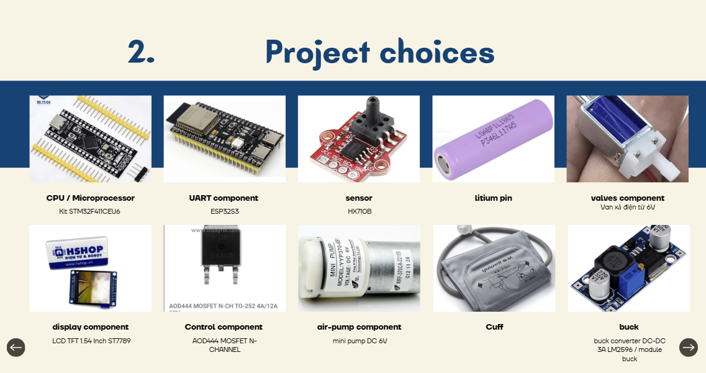
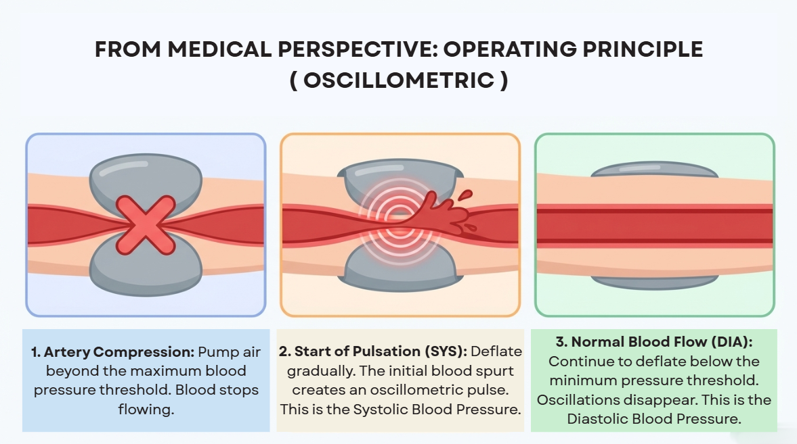
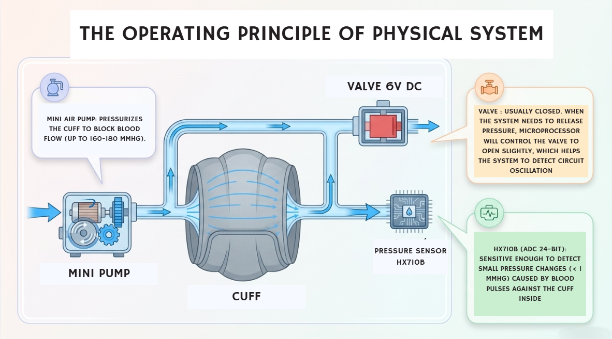
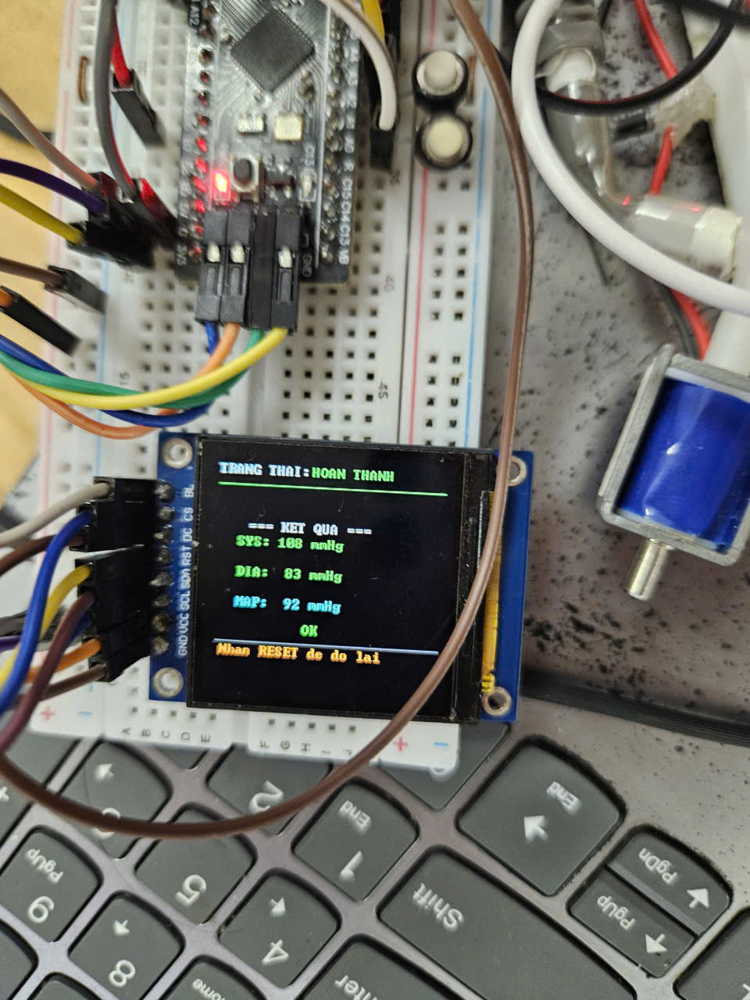
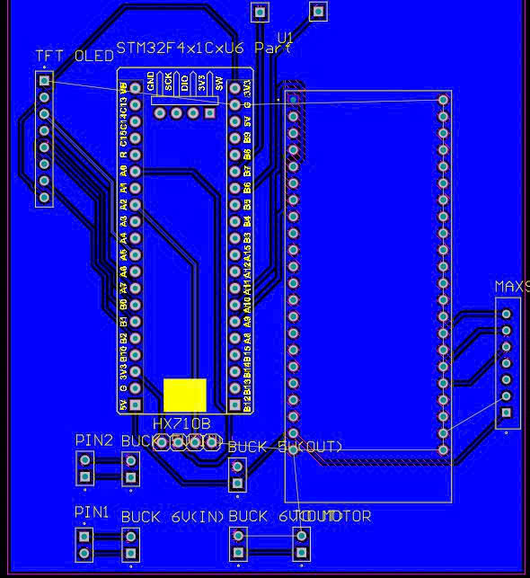
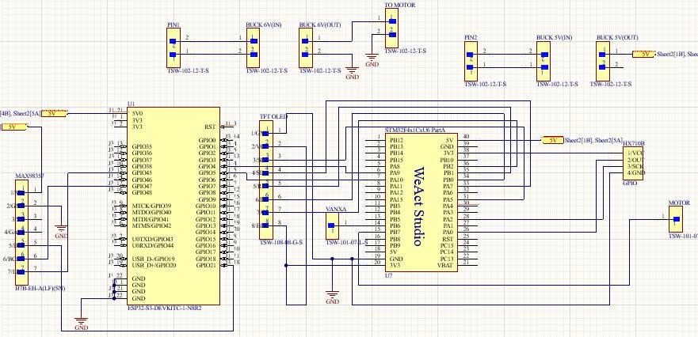
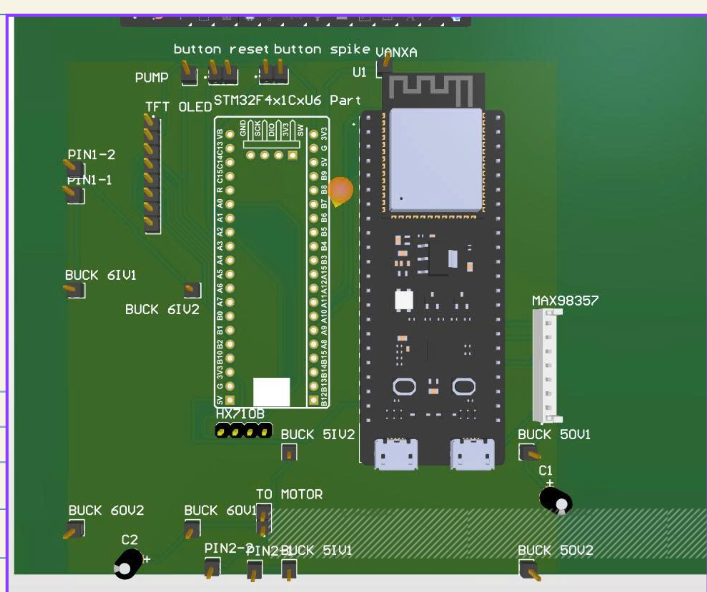

# Introduction

This project is an automatic blood pressure monitoring system built around an **STM32F411 microcontroller**. It measures cuff pressure with an **HX710B** pressure sensor, controls the pump and valve during measurement, and estimates systolic pressure, diastolic pressure, and mean arterial pressure. The results are displayed on an **ST7789** screen and can be sent to an ESP32 for web-based monitoring.

# Project Choices

The **STM32F411** was selected to coordinate sensor readings, pressure control, display updates, and communication. The **HX710B** provides pressure measurements, while **the oscillometric method and a Bayesian estimator** are used to calculate blood pressure values. **A PWM-controlled valve** helps regulate cuff deflation, the **ST7789** provides a local user interface, and UART connects the STM32 to the ESP32.

# Medical Operating Principle

The monitor uses the oscillometric method. The cuff is first inflated to temporarily restrict blood flow, then slowly deflated. As blood begins flowing through the artery, each heartbeat creates small pressure oscillations in the cuff. The device analyzes these oscillations: their maximum amplitude is associated with mean arterial pressure, while systolic and diastolic pressures are estimated from the oscillation pattern using the device’s algorithm. These are device estimates and should not replace measurements or guidance from a healthcare professional.

# System Operating Principle

When a measurement is requested from the web interface, the Flask server makes a trigger available for the ESP32, which polls the server and sends the `START_MEASURE` command to the STM32 over UART. The STM32 reads cuff pressure from the HX710B, inflates the cuff to its target pressure, holds it briefly, and then deflates it at a controlled rate using PWM and a PI valve controller. During deflation, it tracks the heartbeat-induced pressure oscillations and builds an oscillometric envelope. A Bayesian estimator fits that envelope to estimate MAP, then derives systolic and diastolic pressure from the fitted curve; the firmware also checks the result quality. The measurements are shown on the ST7789 display and sent over UART to the ESP32, which uploads the completed SYS, DIA, and MAP results to the Flask server for the web interface to store and display. Afterward, the STM32 opens the valve to release the remaining cuff pressure.

# Results

The system measures cuff pressure and displays the estimated systolic pressure, diastolic pressure, and mean arterial pressure. The measured results are shown below.

# PCB Layout

The PCB layout shows the component placement and routing used to connect the microcontroller, pressure sensor, display, and other circuit components.

# Schematic

The schematic illustrates the main circuit connections between the STM32F411, pressure sensor, display, and supporting components.

# PCB

The PCB provides the physical platform for the system’s electronic components and their connections.

